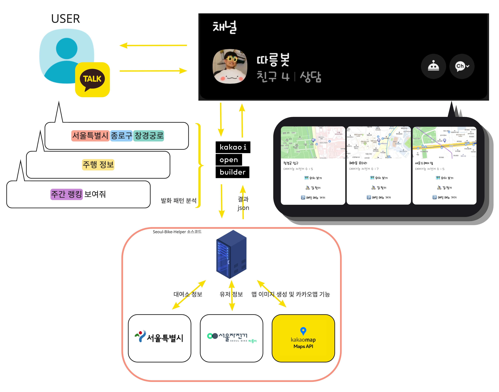

# Seoul-Bike-Helper (따릉봇)

<p align="center">
  
</p>

제가 따릉이를 탈 때 사용하기 위한 따릉이 헬퍼입니다.</br>
추가 기능 아이디어나 도움이 필요하다면 pkeugine@gmail.com 으로 연락주세요.</br>
챗봇은 서버(제 노트북)을 켜 놓고 있지 않으면 작동하지 않을 수 있습니다.😅</br>

## 구조


## 기능
### 주소 기반 실시간 대여소 정보 제공
**도로명 주소도 가능합니다.**</br>
<p align="center">
  
  
</p>

### 즐겨찾기 대여소 실시간 정보 제공
<p align="center">
  
  
</p>

### 선택한 따릉이 대여소 위치, 경로 제공
<p align="center">
  
  
</p>

###  일간, 주간, 월간 사용자 정보 제공
<p align="center">
  
  
</p>

* 주행 시간
* 주행 거리
* 소비 칼로리
* 탄소 절감 효과

### 주간/월간 따릉이 이용 랭킹 및 등락 폭 표시
<p align="center">
  
  
</p>

## 실행 방법
```
# 필요한 패키지 설치
pip install -r requirements.txt

# 서버 실행
python3 main.py

# cron 활성화
flask crontab add

# cron 제거
crontab -r
```
* 크롤링을 위해 [ChromeDriver](https://chromedriver.chromium.org/downloads)가 설치되어 있어야합니다.
* 만약 Chrome 브라우저를 사용하지 않는다면 [Chrome](https://www.google.com/chrome/)도 설치해야 합니다.
* [python3](https://www.python.org/downloads/)가 필요합니다. 저는 3.8.9 버전을 사용했습니다.

## 챗봇 연동 방법
만약 서버를 챗봇과 연결하고 싶다면 카카오톡 채널과 챗봇이 필요합니다.</br>
따릉봇은 무료로 운영할 수 있는 기능만을 활용했습니다.</br>
유저의 실시간 위치를 얻고 싶다면 카카오 비즈니스 역시 활용해야 하는데, 이는 사업자 등록이 우선시 되어야 합니다 🥲 </br>

사용자 발화를 받으려면 이를 챗봇(카카오i 빌더)에서 구분해야 하는데, 다양한 형태로 들어올 수 있는 주소를 처리하는 것이 포인트입니다. </br>
다음과 같이 주소를 세 가지 방식으로 나누어 받을 수 있도록 하면 대여소 검색 기능을 굉장히 편리하게 사용할 수 있습니다:


이러면 모든 형태의 주소를 처리할 수 있게 됩니다:</br>


서초구나 종로구처럼 '구' 단위, 그리고 '서울특별시' 역시 처리할 수 있지만 시간이 오래 걸려서 카카오톡으로부터 응답이 차단 당할 수 있습니다.</br>
따라서 '서울시', '서울특별시'는 따로 응답을 만들고 다음과 같은 설명을 챗봇에 추가하였습니다:</br>


## repository 정보
### main.py
따릉봇의 서버 코드입니다.</br>
아래 정보를 생성하여 소스코드에 추가해야 서버가 실행됩니다:
* openapi 인증키
* 따릉이 계정과 비밀번호
* 카카오맵 api 인증 정보

`{your-어쩌구-저쩌구}` 형태로 되어있어서 `your`을 검색하여 위치를 찾으실 수 있습니다.

### station_info.csv
서울에 있는 모든 따릉이 대여소의 정보가 담겨있습니다.</br>
주소를 활용하기 위해 필요합니다.</br>
openapi 를 통해 받는 정보이므로 실행하기 전 최신화하는 것을 권장합니다.</br>
예시로 2022년 6월 어느 한 시점의 정보를 넣었습니다.

### live_station_info.csv
실시간 따릉이 대여소 정보입니다.</br>
대여 가능한 따릉이 수, 대여소 위도, 대여소 경도, 대여소 이름을 얻기 위해 사용됩니다.</br>
cron 을 활성화하면 5분에 한 번씩 최신화됩니다.</br>
예시로 2022년 6월 어느 한 시점의 정보를 넣었습니다.

### ***_info_history.csv, ***_rank_hisotry.csv
유저의 주행정보와 랭킹을 담는 파일입니다. 예시로 정보 몇 개 넣었습니다.</br>
cron 을 활성화하면 정보가 각각의 주기에 맞게 최신화됩니다.

### requirements.txt
서버를 실행하기 위해 필요한 패키지 정보입니다.</br>
venv 환경을 만들 때 이 파일로 필요한 모든 패키지를 다운 받을 수 있습니다.

## 추가 설명
### 실시간 대여소 정보를 cron 으로 최신화 하는 이유
openapi 를 통해 대여소 정보를 가지고 오는 경우 다음과 같은 불편함이 있습니다:
* open api 에 특정 대여소 정보만 요청할 수 없음
* open api 에 대여소 수를 보내면 그 수만큼의 정보가 나오는데, 정렬되어 있지도 않음
* 굳이 대여소 정보 api 가 두 개임
* 그래서 사용자의 요청이 올 때마다 최신 정보를 제공하려면 open api 에 모든 대여소에 대한 정보를 요청하고 그것을 가공해야함
* 한 번에 1000 개의 대여소 정보만 요청 가능 (대여소는 총 3000개가 넘음)
* 응답의 각 대여소마다 카카오맵 정보와 사용자에게 보여줄 사진을 만들어야 함
* 카카오 챗봇은 서버로부터의 응답이 3~4초가 넘어가는 경우 답변을 포기함

이런 하드코어한... 환경이다보니 대여소의 정보는 사용자 요청과는 별개로 최신화하는 방법을 택했습니다. </br>
따릉이 대여소 특성상 5분 사이에 극단적으로 대여 가능 자전거 수가 바뀌지 않으므로 충분히 신뢰할 수 있는 정보라 판단했습니다.

### thanks to
kakaomap api 관련 아이디어 및 도움을 준 안승수([@ssahn0806](https://github.com/ssahn0806))님 감사합니다 🙏
